```c
page->layout = "post";
page->title  = "SR-71 Blackbird Supersonic Inlet — CFD Analysis";

page->tags   = "Shock-on-Lip Capture at Mach 3.2, ANSYS Fluent, 2D Axisymmetric, SR-71";
page->desc   = "A 2D axisymmetric CFD analysis of the SR-71 inlet at 80,000 ft, capturing zero-spillage shock dynamics and validating historical titanium airframe requirements.";
SET_POST();
```

## **Objective**

The objective of this project is to computationally replicate the SR-71 Blackbird’s center spike inlet at Mach 3.2 cruise conditions (80,000 ft). Specifically, I aimed to capture and validate the "Shock-on-Lip" condition. When the primary oblique shockwave perfectly aligns with the engine cowl, the inlet captures the entire freestream tube—resulting in zero aerodynamic spillage, minimal wave drag, and maximum pressure recovery for the engine. To achieve this, I developed a 2D axisymmetric density-based CFD model in ANSYS Fluent, validated against analytical Taylor-Maccoll solutions.

### Geometry & Domain

To balance computational efficiency with physical accuracy, I modeled the domain as 2D Axisymmetric. This captures the full 3D flow physics around the SR-71's body of revolution without the heavy processing cost of a full 3D mesh. I geometrically scaled the domain at a 1:3 ratio relative to the actual aircraft, modeling the center spike with a length of 1 meter to represent the physical ~3-meter component of the J58 inlet.

For the spike geometry, I used a 20° half-angle, consistent with the documented Mach 3.2 cruise configuration. Handling the cowl lip correctly was an important part of the setup. If left as an open boundary, unphysical shock reflections would propagate upstream and corrupt the internal flow. To prevent this, I modeled the cowl lip as an infinitesimally thin, zero-slip wall right where the shockwave terminates.

<div align="center">
  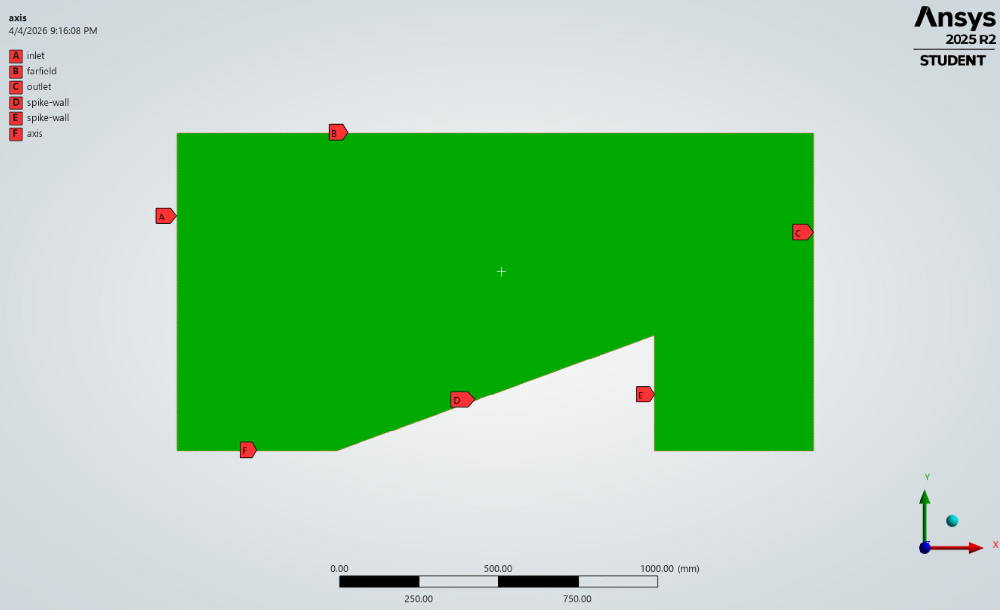
  <p style="font-size: 0.9em; margin-top: 5px; opacity: 0.8;">
    <em>Figure 1: 2D Axisymmetric computational domain with defined boundary conditions <br> (A: Inlet, B: Farfield, C: Outlet, D: Spike Wall, E: Cowl Wall, F: Axis).</em>
  </p>
</div>

### Mesh Strategy

Mesh quality at the spike tip is critical for resolving the oblique shock origin.

A standard inflation layer was applied to all wall surfaces to resolve the boundary layer and capture skin friction accurately. At Mach 3.2, the thermal gradient in the boundary layer is as aerodynamically significant as the pressure gradient.

<div align="center">
  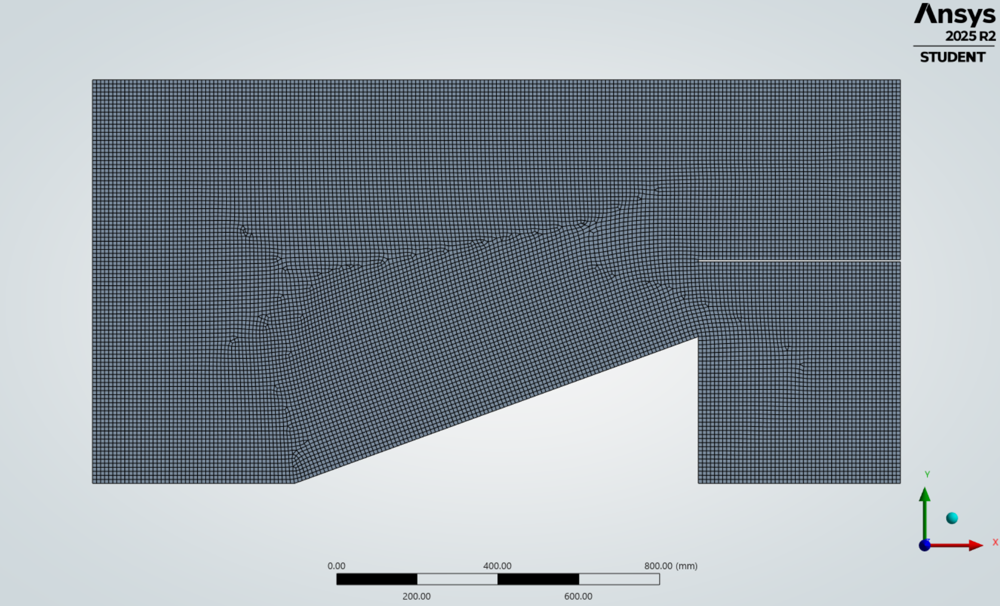
  <p style="font-size: 0.9em; margin-top: 5px; opacity: 0.8;">
    <em>Figure 2: 2D Axisymmetric computational mesh.</em>
  </p>
</div>

<div align="center">
  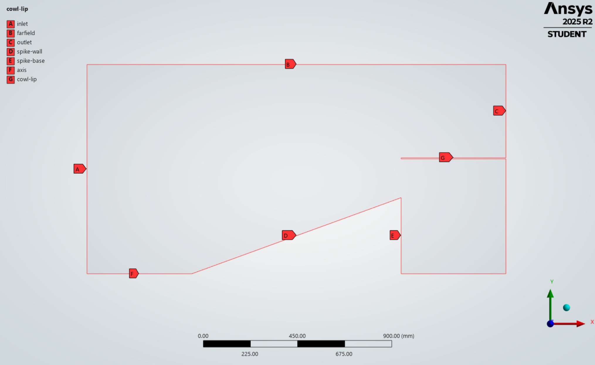
  <p style="font-size: 0.9em; margin-top: 5px; opacity: 0.8;">
    <em>Figure 3: Computational domain with defined boundary conditions</em>
  </p>
</div>

<table style="width: 100%; border-collapse: collapse; font-family: serif; margin: 20px 0; border: 1px solid #444;">
  <thead>
    <tr style="background-color: rgba(255,255,255,0.05); text-align: left;">
      <th style="padding: 12px; border: 1px solid #444;">Setting</th>
      <th style="padding: 12px; border: 1px solid #444;">Choice</th>
      <th style="padding: 12px; border: 1px solid #444;">Justification</th>
    </tr>
  </thead>
  <tbody>
    <tr>
      <td style="padding: 12px; border: 1px solid #444;"><strong>Solver</strong></td>
      <td style="padding: 12px; border: 1px solid #444;">Density-Based</td>
      <td style="padding: 12px; border: 1px solid #444;">Mandatory for $M > 1$ compressible flow. Pressure-based solvers fail under these conditions.</td>
    </tr>
    <tr>
      <td style="padding: 12px; border: 1px solid #444;"><strong>Turbulence Model</strong></td>
      <td style="padding: 12px; border: 1px solid #444;">$k$-$\omega$ SST</td>
      <td style="padding: 12px; border: 1px solid #444;">Highly stable when computing shockwaves that hit the boundary layer, and it accurately predicts flow separation.</td>
    </tr>
    <tr>
      <td style="padding: 12px; border: 1px solid #444;"><strong>Viscosity</strong></td>
      <td style="padding: 12px; border: 1px solid #444;">Sutherland (3-coeff.)</td>
      <td style="padding: 12px; border: 1px solid #444;">Accurately models temperature-dependent viscosity, necessary for stagnation temperatures exceeding 600 K.</td>
    </tr>
  </tbody>
</table>

### **Boundary Conditions — 80,000 ft Atmosphere**

The freestream conditions were derived from the 1976 U.S. Standard Atmosphere at 80,000 ft (≈ 24,400 m)<sup><a href="#ref1">[1]</a><sup>:

- **Inlet / Farfield:** `pressure-far-field` | M = 3.2 | P = 2,970 Pa | T = 220 K | Tu = 1%, μ_t/μ = 1
- **Outlet:** `pressure-outlet` | P = 2,760 Pa | T = 220 K
- **Cowl Lip / Walls:** No-slip | Adiabatic (heat flux = 0 W/m²)

Note: The adiabatic wall condition prevents artificial heat extraction, allowing the physical stagnation temperature to be captured.

### Initialization Strategy

I learned the hard way that starting a density-based solver at Mach 3.2 with standard initial conditions causes an immediate crash. extreme pressure discontinuity at the spike tip creates a mathematical instability in the first iteration - a phenomenon often referred to as "startup shock.”

The solution is Full Multigrid (FMG) Initialization, executed via the Fluent TUI:

`solve/initialize/fmg-initialization yes`

Rather than applying the full viscous physics immediately, FMG first computes a simplified, inviscid (Euler) solution across the domain. This establishes a physically stable baseline pressure field. Learning to implement this step was a critical turning point in the project, as it allowed the complex viscous solver to safely take over and finally drive the simulation to convergence.

<div align="center">
  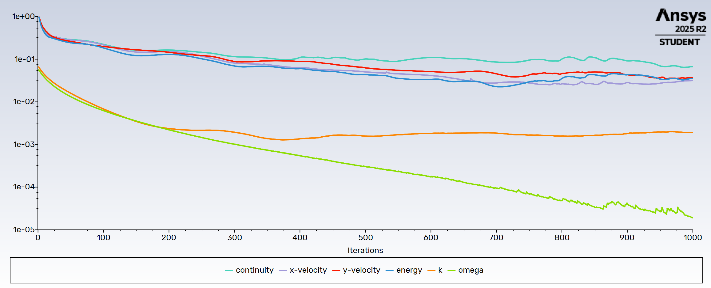
  <p style="font-size: 0.9em; margin-top: 5px; opacity: 0.8;">
    <em>Figure 4: Scaled residuals showing stable convergence over 1000 iterations after FMG initialization.</em>
  </p>
</div>

## Analytical Baseline: Taylor-Maccoll Solver

To establish a theoretical baseline before running the simulation, I wrote a MATLAB script to analytically predict the shock angle using the Taylor-Maccoll equations.

This allowed me to deepen my understanding of compressible aerodynamics while strengthening my computational modeling skills in MATLAB.

Since the SR-71 spike is axisymmetric, basic 2D wedge approximations wouldn't be accurate enough for a baseline because it ignores how the flow behaves in 3D. Instead, I used the exact governing equations for conical flow. I developed a MATLAB script to numerically integrate the Taylor-Maccoll ODE for our specific Mach 3.2 conditions, which gave a predicted shock wave angle of 28.771°.

<details>
<summary style="cursor: pointer; font-weight: bold; font-size: 1.2em; margin: 10px 0; padding: 8px; background-color: rgba(255, 255, 255, 0.05); border-radius: 4px; border: 1px solid rgba(255, 255, 255, 0.1);">MATLAB Code</summary>

  ```matlab
  function TaylorMaccollSolver()
    % Flight conditions and geometry
    M1 = 3.2;                   % Freestream Mach number (SR-71 cruise)
    gamma = 1.4;                % Heat capacity ratio for air
    theta_c_deg = 20;           % Physical cone angle of spike in degrees
    
    % Cone angle degree to radians
    theta_c = deg2rad(theta_c_deg);
    
    % Shock angle (guess)
    beta_guess_deg = theta_c_deg + 10; 
    beta_guess = deg2rad(beta_guess_deg);
    
    fprintf('Solving Taylor-Maccoll for a %.1f degree cone at Mach %.1f...\n', theta_c_deg, M1);
    
    % Finding the exact shock angle
    options = optimset('Display', 'off'); % Suppress iterative output
    beta_sol = fzero(@(beta) calculate_surface_velocity(beta, M1, gamma, theta_c), beta_guess, options);
    beta_sol_deg = rad2deg(beta_sol);

    Mn1       = M1 * sin(beta_sol);
    P02_P01   = ((((gamma+1)/2 * Mn1^2) / (1 + (gamma-1)/2 * Mn1^2))^(gamma/(gamma-1))) * ...
        (((gamma+1) / (2*gamma*Mn1^2 - (gamma-1)))^(1/(gamma-1)));
    
    fprintf('Total Pressure Recovery (P02/P01): %.4f\n', P02_P01);
    
    % Result
    fprintf('Calculated Shock Angle (Beta): %.3f degrees\n', beta_sol_deg);
    
end

% Residual function: returns V_theta at cone surface for a given shock angle

function V_theta_surface = calculate_surface_velocity(beta, M1, gamma, theta_c)
       
    Mn1 = M1 * sin(beta); % Normal Mach component 
    
    % Flow deflection angle (delta) just behind the shock (Anderson p.624)
    tan_delta = 2 * cot(beta) * (Mn1^2 - 1) / (M1^2 * (gamma + cos(2*beta)) + 2);
    delta = atan(tan_delta);
    
    % Mach number behind the shock (M2)
    Mn2_sq = (1 + ((gamma-1)/2)*Mn1^2) / (gamma*Mn1^2 - (gamma-1)/2);
    M2 = sqrt(Mn2_sq) / sin(beta - delta);
    
    % Non-dimensional velocity (V/V_max) behind the shock
    V_prime = sqrt( ((gamma-1)*M2^2) / (2 + (gamma-1)*M2^2) ); %Anderson p.865 (nondimensional velocity)
    
    % Initial conditions for the ODE (Vr and Vtheta at the shock wave)
    Vr_initial = V_prime * cos(beta - delta);
    Vtheta_initial = -V_prime * sin(beta - delta);
    
    % Integrate the Taylor-Maccoll ODE inwards toward the cone
    theta_span = [beta, theta_c]; % Integrate from shock angle down to cone angle
    initial_conditions = [Vr_initial; Vtheta_initial];
    
    [~, V_out] = ode45(@(theta, V) TM_ODE(theta, V, gamma), theta_span, initial_conditions);
    
    % Return the tangential velocity at the cone surface
    % fzero drives this to zero - flow must be tangent to cone surface
    V_theta_surface = V_out(end, 2); 
end

% The Taylor-Maccoll equation (Anderson p. 864)
function dVdtheta = TM_ODE(theta, V, gamma)
    % Unpack the velocity vector
    Vr = V(1);
    Vtheta = V(2);
    
    % Calculate local speed of sound squared (non-dimensional)
    a_sq = ((gamma - 1)/2) * (1 - Vr^2 - Vtheta^2);
    
    % The Taylor-Maccoll non-linear differential equations
    dVr_dtheta = Vtheta;
    
    numerator = a_sq * (Vr + Vtheta * cot(theta));
    denominator = Vtheta^2 - a_sq;
    dVtheta_dtheta = -Vr + (numerator / denominator);
    
    % Pack the derivatives back into a column vector for ode45
    dVdtheta = [dVr_dtheta; dVtheta_dtheta];
end

end

```
</details>

## **Methodology Validation: Unbounded Flow (No Cowl Lip)**

I ran the first phase of the simulation without the cowl lip to isolate the physics of the spike. By letting the shockwave propagate into an open boundary, I avoided complex internal reflections. This allowed me to directly measure the CFD shock angle and confirm it perfectly matched my theoretical MATLAB prediction. Validating this 'unbounded' flow proved that my domain size, mesh, and solver settings were correct. With the baseline locked in, I then added the physical cowl wall to capture the final flowfield.


<div align="center">
  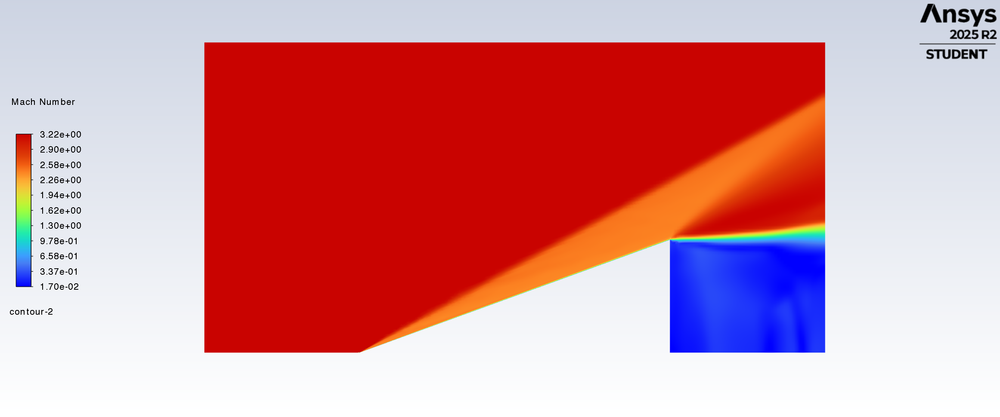
  <p style="font-size: 0.9em; margin-top: 5px; opacity: 0.8;">
    <em>Figure 5: Mach number contour (unbounded flow). The oblique shock originates clearly at the sharp (0,0) tip and <br>propagates outward at ~28.8°, matching the theoretical prediction and validating the mesh density.</em>
  </p>
</div>

<div align="center">
  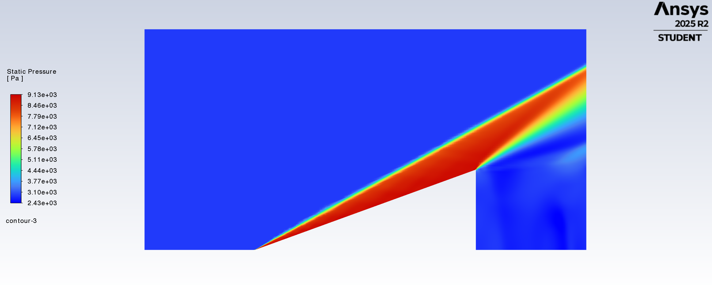
  <p style="font-size: 0.9em; margin-top: 5px; opacity: 0.8;">
    <em>Figure 6: Static pressure contour (unbounded flow). Demonstrates the clean pressure discontinuity of <br> the shockwave before interacting with any downstream geometry.</em>
  </p>
</div>

<div align="center">
  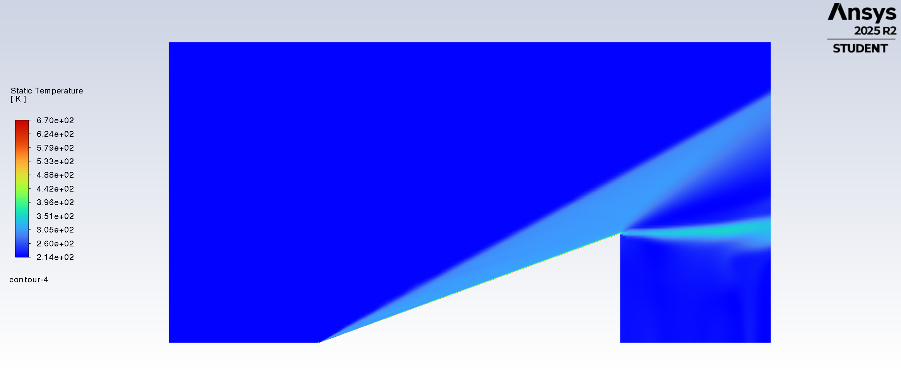
  <p style="font-size: 0.9em; margin-top: 5px; opacity: 0.8;">
    <em>Figure 7: Static temperature contour (unbounded flow). Shows the baseline aerodynamic heating along the spike<br> boundary layer and across the shockwave prior to stagnation against the cowl wall.</em>
  </p>
</div>

## CFD Results & Validation

### 1. Shock on Lip Condition

The simulation confirmed the oblique shockwave originating at the spike tip and propagating at ~28.8°, aligning perfectly with the Taylor-Maccoll analytical prediction.

<div align="center">
  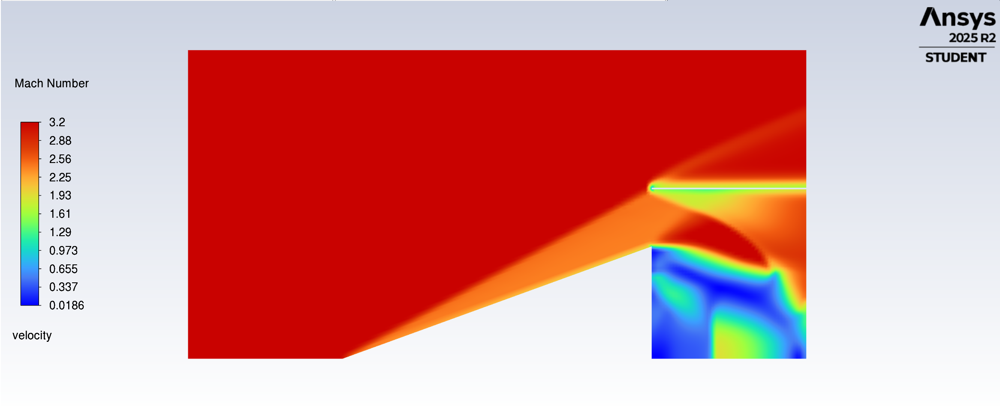
  <p style="font-size: 0.9em; margin-top: 5px; opacity: 0.8;">
    <em>Figure 8: Mach number contour validating the Shock-on-Lip condition.<br> The freestream is captured entirely by the inlet with zero spillage.</em>
  </p>
</div>

### **2. Internal Compression & Pressure Field**

Inside the inlet channel, the contours and velocity vectors reveal the train of reflected oblique shocks between the spike surface and the cowl wall. Each reflection represents a progressive deceleration and compression of the flow toward the compressor face.

<div align="center">
  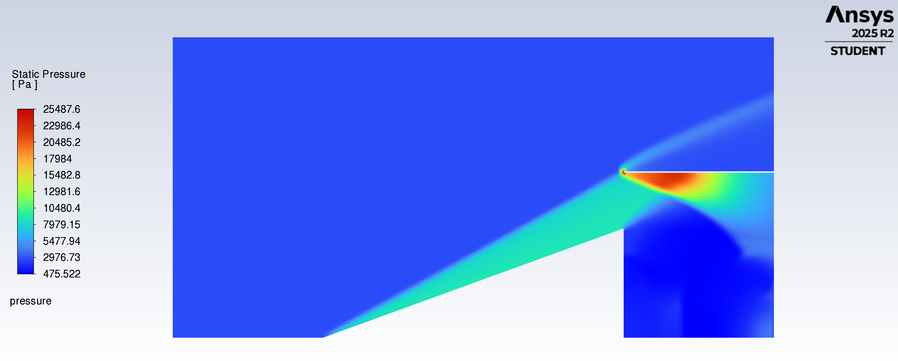
  <p style="font-size: 0.9em; margin-top: 5px; opacity: 0.8;">
    <em>Figure 9: Static pressure contour showing the primary oblique shock and internal compression wave train.</em>
  </p>
</div>

<div align="center">
  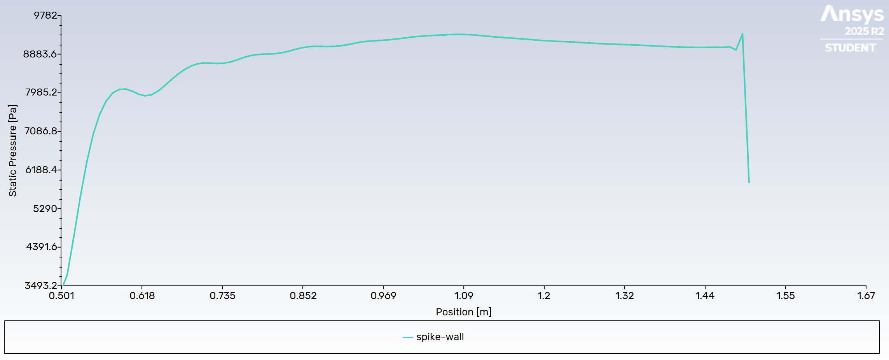
  <p style="font-size: 0.9em; margin-top: 5px; opacity: 0.8;">
    <em>Figure 10: Static pressure distribution along the spike wall, quantifying the compression profile.</em>
  </p>
</div>

<div align="center">
  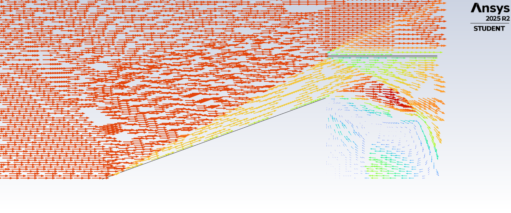
  <p style="font-size: 0.9em; margin-top: 5px; opacity: 0.8;">
    <em>Figure 11: Velocity vectors detailing flow direction and internal deceleration dynamics within the diffuser.</em>
  </p>
</div>

### **3. Kinetic Heating Analysis**

The static temperature field at the cowl lip demonstrates the severe thermal environment. Operating with an adiabatic wall condition, the stagnation temperature was allowed to build up physically.

<div align="center">
  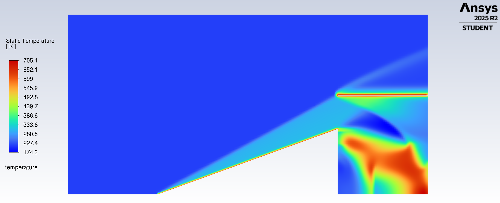
  <p style="font-size: 0.9em; margin-top: 5px; opacity: 0.8;">
    <em>Figure 12: Static temperature contour. The freestream enters at 220 K, but localized stagnation<br> regions at the cowl lip exceed 673 K.</em>
  </p>
</div>

Temperatures at the lip reached approximately 673 K (~400°C). Traditional structural aluminum alloys begin losing structural integrity above 150°C. Capturing this thermal profile computationally demonstrates exactly why the SR-71 had to be constructed primarily from heat-resistant titanium alloys.

### Conclusion

This analysis successfully validated the SR-71 inlet geometry and operating conditions. Through this project, I:

• Built a custom MATLAB solver to analytically verify the Mach 3.2 shock angle before relying on the CFD software.

• Prevented numerical artifacts and internal shock reflections by explicitly modeling a zero-slip cowl wall instead of a standard open boundary.

• Overcame initial solver crashes ("startup shock") by researching and implementing FMG initialization to stabilize the highly compressible flow.

• Used the computed stagnation temperatures (400 C) to mathematically demonstrate why the engineers had to build the SR-71 out of titanium.


#### References 

<p id="ref1">[1] U.S. Standard Atmosphere, 1976. National Oceanic and Atmospheric Administration. Table 4, p. 134. <a href=" https://ntrs.nasa.gov/api/citations/19770009539/downloads/19770009539.pdf" target="_blank">View Document</a></p>