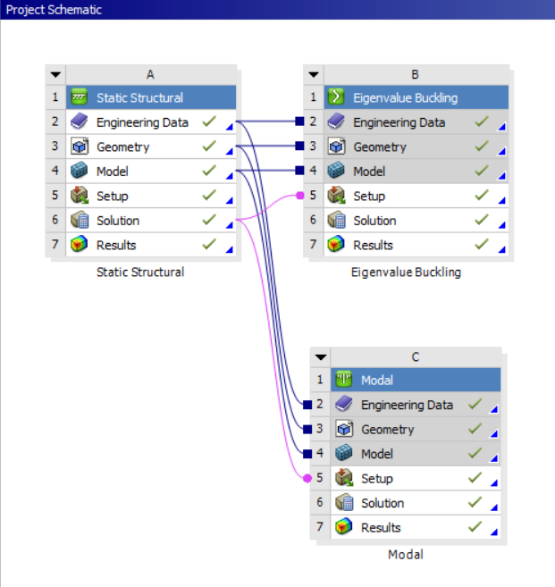
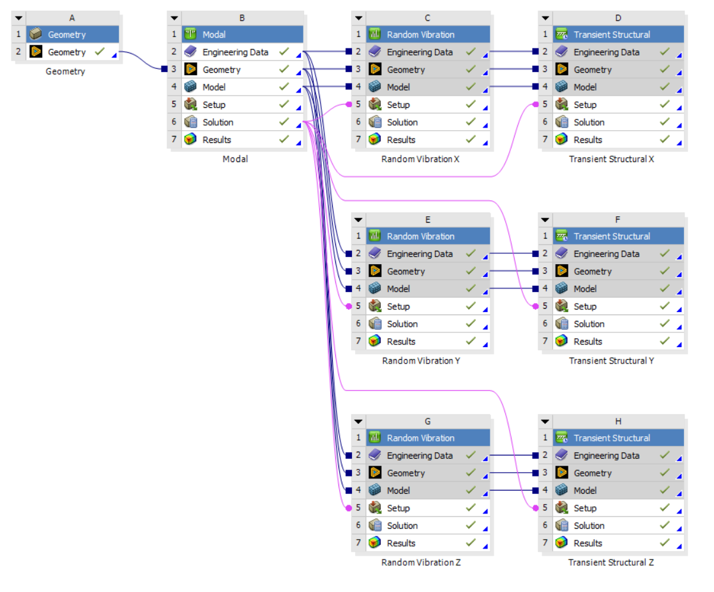

---
page->layout = "post";
page->title  = "What I’ve Learned From My FEM Course";

page->tags   = "ANSYS, FEA, Static Structural";
page->desc   = "A technical showcase of my progression in ANSYS, moving from basic static structural simulations and kinematics to multi-axis MIL-STD-810H dynamic qualification.";
SET_POST();
---

---
> **Notice regarding visual data:** *Due to university and project confidentiality restrictions, all original CAD images, mesh displays, and simulation results have been redacted from this portfolio. The text below accurately reflects my exact methodology, solver setups, and analysis workflows. I am currently in the process of re-running these analyses on open-source, non-proprietary geometry and will update this page with the new visual data soon.*

---

Throughout my Finite Element Method (FEM) course, I progressed from basic static structural simulations to complex multi-body rigid dynamics using ANSYS. Below is a showcase of my key learnings and the progression of my simulation skills.

## Static Structural Basics

For my first static structural analysis, I calculated the stress concentration and reaction forces on a simple rectangular plate with a central hole.

  
  

    <em>Figure 1: Initial project schematic for Static and Buckling analysis.</em>
  

Next, I linked multiple analysis systems in Workbench.
I used Modal analysis to determine natural frequencies and Eigenvalue Buckling analysis to find the critical loads.

I utilized **Remote Points** and **Remote Displacement** to analyze a curved beam. This allowed me to apply loads and boundary conditions from a specific location outside the geometry.

I evaluated a C-bracket for bending stresses and total deformation. The stress plot clearly captures the expected stress concentration along the inner radius.

Moving from single parts to assemblies, I learned to manage component interactions. I set up specific contact regions, like bonded and no-separation faces, to ensure the linkage behaved realistically under load.

## Contact Mechanics

I analyzed this pliers assembly to evaluate stress distribution under load. Correctly defining the contact behaviors allowed me to accurately capture the stress concentration at the pivot point.

## Kinematic Joints & Assemblies

Moving beyond basic contacts, I needed to simulate real-world motion. I defined revolute and translational joints to accurately drive the kinematics of a scissor lift and a pinned bracket.

To evaluate internal component interactions, I analyzed a caster wheel assembly. I used **c**ross-section views to visualize the total deformation and contact behavior between the axle, bearings, and wheel housing under static loading.

## Rigid Body Dynamics

I modeled a three-link mechanism using the Rigid Dynamics module to evaluate its kinematic behaviour. I defined revolute joints and a point mass, then applied a rotational velocity motor to simulate the system's motion. Finally, I used a Joint Probe to extract the required torque data over time.

## Dynamic Assessment of a Console Desk (My Final Project)

For my final project, I’ve completed Modal, Random Vibration, and Transient Shock analysis on a Console Desk assembly. 

  
  

    <em>Figure 2: Complex multi-body rigid dynamics and vibration workflow.</em>
  

I optimized the model for better run times by midsurfacing, switching to shell elements, and using deformable beams for the bolt connections.

After identifying natural frequencies via modal analysis, I subjected the assembly to random vibration and transient shock in the X, Y, and Z directions.

The design was qualified to MIL-STD-810H through a 20G sawtooth shock analysis and Steinberg fatigue evaluation. I accounted for mesh singularities during the stress review to ensure an accurate verification.

I evaluated the fatigue life under Random Vibration using the Steinberg criteria. The worst-case damage ratio occurred in the Z-axis at 0.095, well below the failure threshold of 1.0, ensuring long-term structural integrity.

I documented the entire methodology, boundary conditions, and final evaluations in a comprehensive 24-page technical report.

## What’s next?

I plan to apply these FEA techniques directly to my rocketry team's projects. I am also taking a CFD course this semester to learn ANSYS Fluent, my first major project will be a 2D flow analysis of the SR-71 engine inlet.

Note to myself: Never use non-English characters in an ANSYS file name. Otherwise, you will spend 10 hours trying to debug a complex solver error, only to realize the simulation failed because you put a Turkish character in the folder name.

### Special thanks

A huge thank you to my lecturer, Burak Özcan. This was easily the best and most practical course I took this semester.

